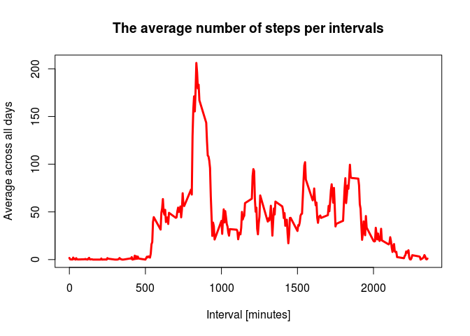

# Reproducible Research: Peer Assessment 1


## Loading and preprocessing the data

1. Load the data by reading the csv data (using read.csv())

```r
# Load the original activity data, check for the names of the variables and display the first few rows of the data.
original_activity <- read.csv("activity.csv", stringsAsFactors = FALSE)
names(original_activity)
```

```
## [1] "steps"    "date"     "interval"
```

```r
head(original_activity)
```

```
##   steps       date interval
## 1    NA 2012-10-01        0
## 2    NA 2012-10-01        5
## 3    NA 2012-10-01       10
## 4    NA 2012-10-01       15
## 5    NA 2012-10-01       20
## 6    NA 2012-10-01       25
```
2. Process/transform the data (if necessary) into a format suitable for your analysis.
The first step in doing this is to determine the data type of each of the variables that are in the data.

```r
class(original_activity$steps)
```

```
## [1] "integer"
```

```r
class(original_activity$date)
```

```
## [1] "character"
```

```r
class(original_activity$interval)
```

```
## [1] "integer"
```
As part of the analysis that will be needed in this assigment, one will need to create factor levels for days into weekdays and weekend. Hence, it is neccessary to transform date that is recorded as character into date objects. In addition, to this one can create a new columns of days in the week and then another column that will factors days into weekdays and weekend.


```r
# The date was recorded as character data type, transform the date attribute to an actual date format
original_activity$date <- as.POSIXct(original_activity$date, format = "%Y-%m-%d")
```


```r
# compute the days of the week from the date attribute
original_activity <- data.frame(date=original_activity$date, day = tolower(weekdays(original_activity$date)), steps = original_activity$steps, interval = original_activity$interval)

# Computer the daytype (weekend or weekday)
original_activity <- cbind(original_activity, daytype = ifelse(original_activity$day == "saturday" | original_activity$day == "sunday", "weekend", "weekday"))
```
Generate the final data in form of a data frame, remove the original data and display the first few rows of the new data frame.


```r
# Now create the final data as a data frame
activity <- data.frame(date = original_activity$date, day = original_activity$day, daytype = original_activity$daytype, interval = original_activity$interval, steps = original_activity$steps)
# remove the original activity data
rm(original_activity)
# display first few rows of the activity data frame
head(activity)
```

```
##         date    day daytype interval steps
## 1 2012-10-01 monday weekday        0    NA
## 2 2012-10-01 monday weekday        5    NA
## 3 2012-10-01 monday weekday       10    NA
## 4 2012-10-01 monday weekday       15    NA
## 5 2012-10-01 monday weekday       20    NA
## 6 2012-10-01 monday weekday       25    NA
```
## What is mean total number of steps taken per day?
For this part of the assignment, you can ignore the missing values in the dataset. 

1. Calculate the total number of steps taken per day.
This is done by aggregating the number of steps by date and store it in a new data frame. Then rename the variables as date and totalSteps. First few lines are displayed.


```r
# Compute the total number of steps taken each day ignoring the missing values
stepsTotal <- aggregate(activity$steps, by = list(activity$date), FUN = sum, na.rm = TRUE)

# rename the variables of the stepsTotal data frame
names(stepsTotal) <- c("date", "totalSteps")
head(stepsTotal)
```

```
##         date totalSteps
## 1 2012-10-01          0
## 2 2012-10-02        126
## 3 2012-10-03      11352
## 4 2012-10-04      12116
## 5 2012-10-05      13294
## 6 2012-10-06      15420
```

2. Make a histogram of the total number of steps taken per day.

```r
hist(stepsTotal$totalSteps, main ="Total number of steps by day", xlab = "Total number of steps",ylab = "Number of days", col = "red")
```

 

3. Calculate and report the mean and median of the total umber of steps taken per day.


```r
Mean <- mean(stepsTotal$totalSteps)
Median <- median(stepsTotal$totalSteps)
```
The mean is 9354.23 and the median is 10395

## What is the average daily activity pattern?

1. Make a time series plot (i.e. type = "l") of the 5-minute interval (x-axis) and the average number of steps taken, averaged across all days (y-axis).


```r
# compute the means of steps across all days for each interval
mean_steps <- aggregate(activity$steps, by = list(activity$interval), FUN = mean, na.rm = TRUE)

# Rename the variable names
names(mean_steps) <- c("interval","meanSteps")
```
Display the first few rows of average number of daily steps at each interval.

```r
# display the first few rows of the mean of daily steps
head(mean_steps)
```

```
##   interval meanSteps
## 1        0 1.7169811
## 2        5 0.3396226
## 3       10 0.1320755
## 4       15 0.1509434
## 5       20 0.0754717
## 6       25 2.0943396
```
Time series plot of average number of steps across all days versus time interval.

```r
# Compute the time series plot
plot(mean_steps$interval, mean_steps$meanSteps, type="l", col="red", lwd = 3, xlab="Interval [minutes]", ylab="Average across all days", 
     main="The average number of steps per intervals")
```

 

2. Which 5-minute interval, on average across all the days in the dataset, contains the maximum number of steps?
This is done by first finding the position of the maximum mean of daily steps at given interval. Then find the time interval that correspond to that position.

```r
# We find the position of the maximum mean
max_pos <- which(mean_steps$meanSteps == max(mean_steps$meanSteps))

# We lookup the value of interval at this position
max_interval <- mean_steps[max_pos, 1]
```
The 5-minute interval with maximum nuber of steps is 835


## Imputing missing values

1. Calculate and report the total number of missing values i nthe dataset (i.e. the total number of rows with NAs)

Using the fact that  a TRUE boolean value is equivalent to 1 and a FALSE to 0. One can create a logical variable which count NA and assign TRUE that is 1. Then count the number of 1 to determine how many NAs are in the dataset.


```r
# We can use the fact that a TRUE boolean value is equivalent to 1 and a FALSE to 0. 
count_NA <- sum(is.na(activity$steps))
```
The total number of missing values is 2304

2. Devise a strategy for filling in all of the missing values in the dataset. The strategy does not need to be sophisticated. For example, you could use the mean/median for that day, or the mean for that 5-minute interval, etc.


```r
# Find the positions of the missing values
pos_NA <- which(is.na(activity$steps))

# create a vector of means
vector_means <- rep(mean(activity$steps, na.rm = TRUE), times = length(pos_NA))
```

3. Create a new dataset that is equal to the original dataset but with the missing data filled in.  

The first few lines are displayed as follow:

```r
# Now we replace NAs by the mean values
activity[pos_NA, "steps"] <- vector_means
# display the first few rows of the mean of daily steps
head(activity)
```

```
##         date    day daytype interval   steps
## 1 2012-10-01 monday weekday        0 37.3826
## 2 2012-10-01 monday weekday        5 37.3826
## 3 2012-10-01 monday weekday       10 37.3826
## 4 2012-10-01 monday weekday       15 37.3826
## 5 2012-10-01 monday weekday       20 37.3826
## 6 2012-10-01 monday weekday       25 37.3826
```

4. Make a histogram of the total number of steps taken each day and Calculate and report the mean and median total number of steps taken per day. Do these values differ from the estimates from the first part of the assignment? What is the impact of imputing missing data on the estimates of the total daily number of steps?

```r
# Compute the total number of steps taken each day 
stepsTotal <- aggregate(activity$steps, by = list(activity$date), FUN = sum, na.rm = TRUE)

# rename the variables of the stepsTotal data frame
names(stepsTotal) <- c("date", "totalSteps")
head(stepsTotal)
```

```
##         date totalSteps
## 1 2012-10-01   10766.19
## 2 2012-10-02     126.00
## 3 2012-10-03   11352.00
## 4 2012-10-04   12116.00
## 5 2012-10-05   13294.00
## 6 2012-10-06   15420.00
```

```r
# make histogram of the total number of steps taken each day
hist(stepsTotal$totalSteps, main ="Total number of steps by day", xlab = "Total number of steps",ylab = "Number of days", col = "red")
```

 


```r
Mean <- mean(stepsTotal$totalSteps)
Median <- median(stepsTotal$totalSteps)
```
The new mean and the median are 10766 and 10766 respectively.

These values are different from the estimates done in the first part of this assignment. The impact of replacing missing values with average values, while increasing the number of data, it also increase the value of mean and median of the dataset. In addition to this, assuming the mode of the dataset also comes out to be 10766, one can conclude that the effect of replacing missing values with mean values make transform the dataset from s skewed distribution into a normal distribution. 

## Are there differences in activity patterns between weekdays and weekends?

1. Create a new factor variable in the dataset with two levels – “weekday” and “weekend” indicating whether a given date is a weekday or weekend day.

The creation of new factor variable in the dataset with two levels has been included in the preprocessing stage above. So the current dataset is sufficient to make the required panel plot in the next step.

2. Make a panel plot containing a time series plot (i.e. type = "l") of the 5-minute interval (x-axis) and the average number of steps taken, averaged across all weekday days or weekend days (y-axis). See the README file in the GitHub repository to see an example of what this plot should look like using simulated data.


```r
# Load the lattice graphical library
library(lattice)

# Compute the average number of steps taken, averaged across all daytype variable
avgNum_steps <- aggregate(activity$steps, 
                       by=list(activity$daytype, 
                               activity$day, activity$interval), mean)

# Rename the attributes
names(avgNum_steps) <- c("daytype", "day", "interval", "mean")

head(avgNum_steps, n=7)
```

```
##   daytype       day interval     mean
## 1 weekday    friday        0 8.307244
## 2 weekday    monday        0 9.418355
## 3 weekend  saturday        0 4.672825
## 4 weekend    sunday        0 4.672825
## 5 weekday  thursday        0 9.375844
## 6 weekday   tuesday        0 0.000000
## 7 weekday wednesday        0 7.931400
```

```r
# Compute the time serie plot
xyplot(mean ~ interval | daytype, avgNum_steps, type="l", layout=c(1,2),lwd=2, xlab="Interval", ylab="Number of steps", col="red")
```

 

There are few obvious differences in the weekdays and weekend data. Especially in the first 1000 time interval which most likely will be in the morning. During this period it is expected that the activity of weekedays will be more than weekend. Another period is beyond 2000 time interval. Weekend appear to be more quiet at the period beyond 2000 time interval.
